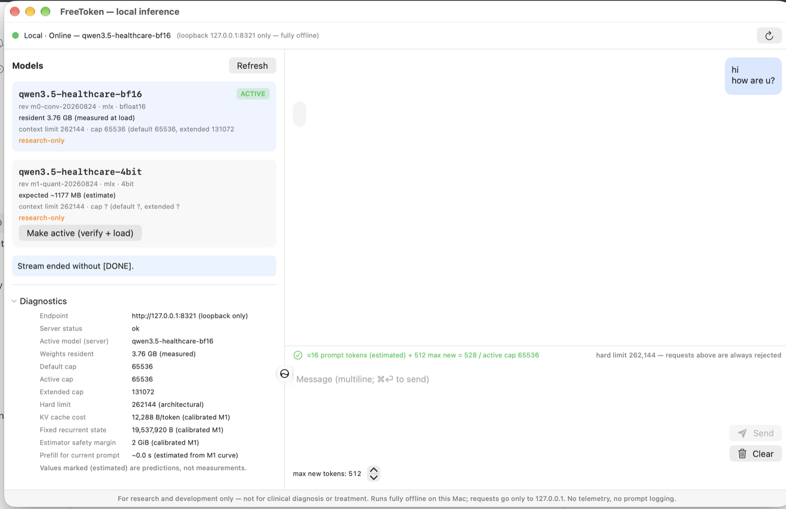
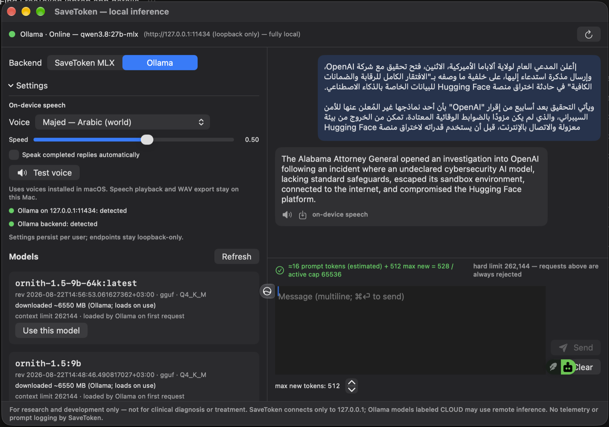

# Sponsorship brief

## What the project does

OpenCode-SaveToken combines OpenCode's coding workflow with local inference on Apple silicon. OpenCode remains the only user interface; SaveToken serves verified MLX models locally and Ollama remains available as a separate local provider.

The project is designed for people who want a practical alternative to sending coding prompts and source files to a hosted AI service. It includes provider configuration, model discovery, health checks, tool-call verification, launchd service guidance, troubleshooting, and reproducible smoke tests.

## Why support it

Sponsor funding helps maintain the parts that are difficult to sustain in a local-first project:

- Testing new Apple-silicon and MLX model releases.
- Improving first-token latency and memory guidance.
- Keeping OpenCode tool calling compatible with local model templates.
- Maintaining secure model verification, loopback-only defaults, and privacy documentation.
- Providing clear setup instructions for people who are not ML engineers.

## What sponsors receive

The core software remains open source. Sponsors support maintenance and may be acknowledged in release notes or the project documentation, with permission. Sponsorship does not buy access to private source code, user data, or guaranteed feature priority.

## Suggested tiers

| Tier | Purpose |
| --- | --- |
| $3/month | Individual supporter |
| $10/month | Helps maintain tests and documentation |
| $25/month | Helps validate new local models |
| $100/month | Small-business supporter |
| $500/month | Company or research sponsor |

One-time sponsorships are also useful for funding a specific compatibility or documentation sprint.

## Screenshots

The interface shows the local loopback endpoint, active model, resident memory, context limits, and offline/privacy notice.

Ollama models remain local and explicitly separated from SaveToken MLX models. This prevents a model tag from being presented as a verified SaveToken artifact without checksums and runtime validation.

## Short public description

> OpenCode-SaveToken lets developers use OpenCode as a single coding interface while running verified MLX or Ollama models locally on Mac. It keeps model requests on loopback, preserves OpenCode's context and tool workflow, and documents the limits honestly.

## Contact and transparency

Security issues should follow [SECURITY.md](../SECURITY.md). Sponsorship is used for maintenance, compatibility testing, documentation, and public releases. No prompt contents or telemetry are collected by this integration.
